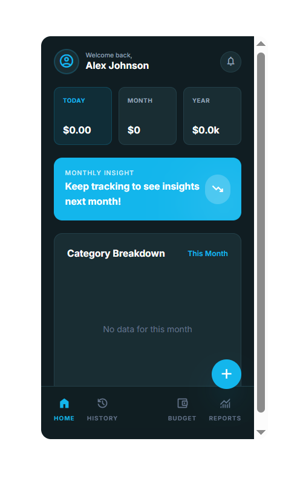
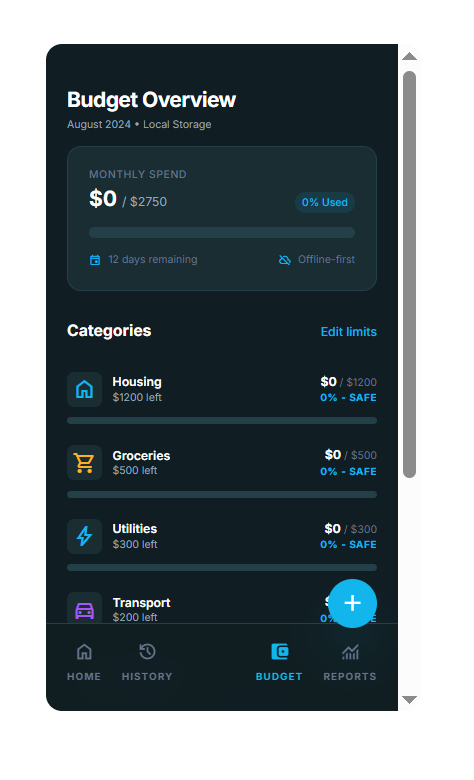

## Screenshots




## Run and deploy your AI Studio app

This contains everything you need to run your app locally.

## Run Locally

**Prerequisites:** Node.js

1. Install dependencies:  
   `npm install`

2. (Optional) If the project uses Gemini features, set `GEMINI_API_KEY` in [.env.local](.env.local) to your Gemini API key.

3. Run the app:  
   `npm run dev`

## Build an Android APK (Installable App)

This project is a web app. To install it on Android as an APK, wrap it with **Capacitor**.

**Prerequisites (Android):**
- Node.js
- Android Studio (includes Android SDK)
- JDK 17 (recommended)

## 1) Build the web app

```bash
npm install
npm run build

# Add Capacitor + Android platform
# Replace com.yourcompany.expensemanager with your own unique package id.
npm i @capacitor/core @capacitor/cli @capacitor/android
npx cap init "Household Expense Manager" com.yourcompany.expensemanager --web-dir=dist
npx cap add android
npx cap sync android

# Open in Android Studio
npx cap open android

# Generate the APK
# In Android Studio:
# Build → Build Bundle(s) / APK(s) → Build APK(s)
#
# Your APK will be generated and you can install it on a device (or share it).
